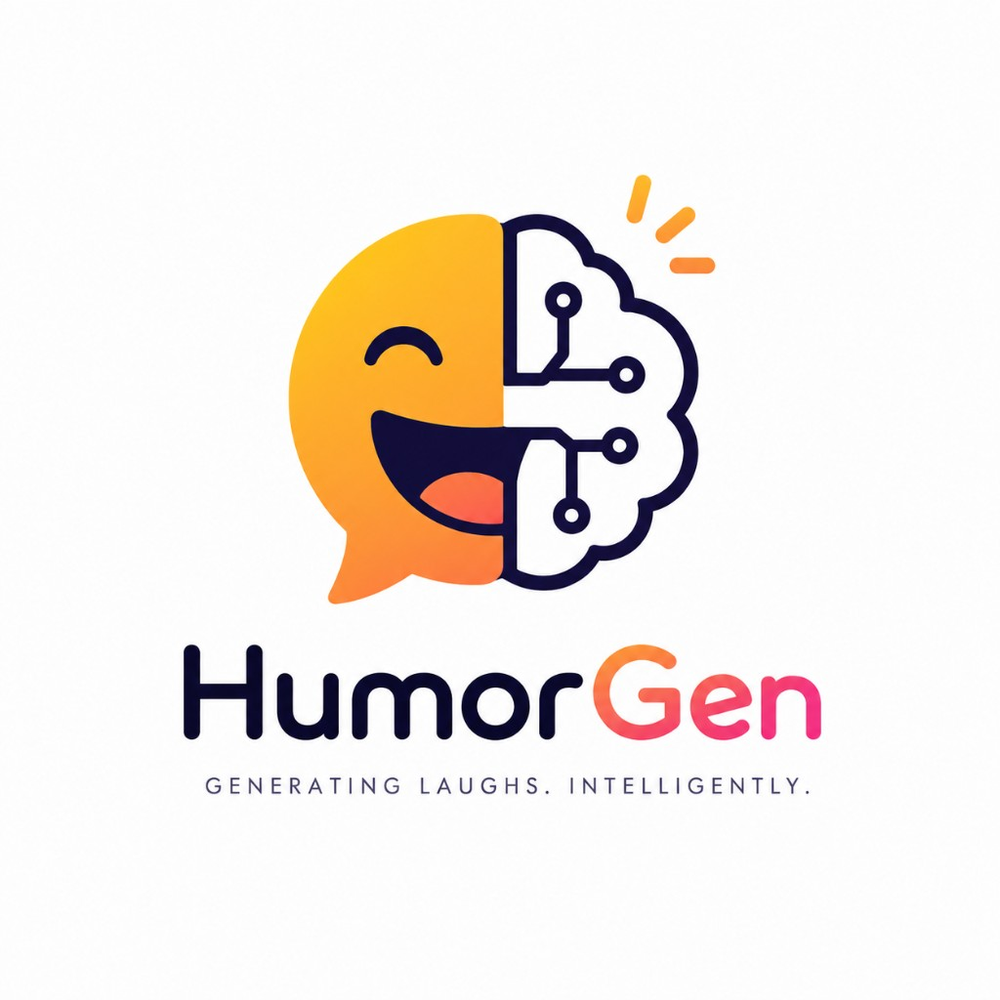

<p align="center">
  <a href="https://humorgen.pages.dev">
    
  </a>
</p>

<p align="center">
  <strong>An open-weight ecosystem for computational humor generation</strong>
</p>

<p align="center">
  <a href="https://humorgen.pages.dev"></a>
  <a href="https://arxiv.org/abs/2604.09629"></a>
  <a href="https://huggingface.co/collections/Jayi2424/humorgen"></a>
  <a href="https://www.apache.org/licenses/LICENSE-2.0"></a>
</p>

<p align="center">
  <a href="https://humorgen.pages.dev">
    
    Visit the project website
  </a>
  &nbsp;·&nbsp;
  <a href="https://arxiv.org/abs/2604.09629">
    
    Read the HumorGen paper
  </a>
  &nbsp;·&nbsp;
  <a href="https://huggingface.co/datasets/Jayi2424/HumorTransferBench">
    
    HTB benchmark
  </a>
</p>

---

HumorGen teaches language models to be genuinely funny — not just to produce text that sounds like a joke. Instead of asking one model to be funny, the **Cognitive Synergy Framework** runs six comedic personalities in parallel, ranks the drafts with an AI judge, and distills the winners into efficient student models.

> **Key finding:** Good training data beats model scale. Our student models rank among the strongest open humor models, beating systems many times their size — and adding preference tuning on top brings little extra gain once the data is well-chosen.

---

## Website

The full project — framework, leaderboards, models, usage, and papers — is live:

### **[humorgen.pages.dev](https://humorgen.pages.dev)**

| Section | What's there |
|:---|:---|
| **Framework** | Six comedic personas + humor theories |
| **Results** | HTB & SemEval leaderboards |
| **Model collections** | All 14 LoRA adapters on Hugging Face |
| **Usage** | Copy-paste inference snippets |
| **Papers** | HumorGen + JOKER PDFs & citations |

<p align="center">
  <a href="https://humorgen.pages.dev">
    
  </a>
</p>

---

## Papers

| | Title | Link |
|:---|:---|:---|
| **HumorGen Paper** | HumorGen: Cognitive Synergy for Humor Generation in Large Language Models via Persona-Based Distillation | [View PDF ↗](https://arxiv.org/abs/2604.09629) |
| **HumorGen-JOKER Paper** | Cross-Lingual Cognitive Synergy for Constrained Humor Generation in LLMs | [View PDF ↗](https://edwardajayi.github.io/assets/papers/HumorGen-JOKER.pdf) |

**Authors:** Edward Ajayi & Prasenjit Mitra

---

## Model collections

**14 open-weight LoRA adapters on Hugging Face** · [Jayi2424/HumorGen](https://huggingface.co/collections/Jayi2424/humorgen)

| Family | Scale | What it does |
|:---|:---|:---|
| **Core HumorGen** | 7B | Open-ended headline humor · full training-method ablation |
| **Multilingual base** | 14B & 32B | General humor prior (English headlines) |
| **JOKER Task 4** | 14B & 32B | Constrained pun-brief generation · EN / FR / ES |

Top performers on our benchmarks: **HumorGen-SFT-7B** and **HumorGen-DPO-7B**.

---

## Benchmarks

| Benchmark | Description | Link |
|:---|:---|:---|
| **Humor Transfer Bench (HTB)** | 400-prompt evaluation set across 8 input styles | [Dataset ↗](https://huggingface.co/datasets/Jayi2424/HumorTransferBench) |
| **SemEval MWAHAHA** | News-headline humor generation | [Competition ↗](https://www.codabench.org/competitions/9719/) |
| **CLEF JOKER Task 4** | Constrained cross-lingual pun generation | [Competition ↗](https://www.codabench.org/competitions/13879/) |

Leaderboards and full tables: [humorgen.pages.dev/#results](https://humorgen.pages.dev/#results) · [paper appendix](https://arxiv.org/abs/2604.09629)

---

## Quick start

```bash
git clone https://github.com/edwardajayi/HumorGen.git
cd HumorGen
pip install -r requirements.txt
```

Python 3.10+. Set `GROQ_API_KEY` / `OPENAI_API_KEY` in env or `.env` for API-based scripts.

```python
from transformers import AutoModelForCausalLM, AutoTokenizer
from peft import PeftModel
import torch

tokenizer = AutoTokenizer.from_pretrained("Qwen/Qwen2.5-7B-Instruct")
model = AutoModelForCausalLM.from_pretrained(
    "Qwen/Qwen2.5-7B-Instruct", torch_dtype=torch.bfloat16, device_map="auto")
model = PeftModel.from_pretrained(model, "Jayi2424/HumorGen_SFT_7B")
```

More examples on the [website usage section](https://humorgen.pages.dev/#usage).

---

## Repository layout

```
HumorGen/
├── website/          # Live site (humorgen.pages.dev)
├── training/         # SFT, DPO, O-GRPO, JOKER curriculum
├── evaluation/       # Pairwise judging & leaderboards
├── testing/          # Generation scripts
├── src/              # HumorRank, generators, utilities
└── data/datasets/    # MWAHAHA and prompt sets
```

---

## Citation

```bibtex
@misc{ajayi2026humorgen,
  title         = {HumorGen: Cognitive Synergy for Humor Generation in Large Language
                   Models via Persona-Based Distillation},
  author        = {Ajayi, Edward and Mitra, Prasenjit},
  year          = {2026},
  eprint        = {2604.09629},
  archivePrefix = {arXiv},
  primaryClass  = {cs.CL},
  url           = {https://arxiv.org/abs/2604.09629}
}
```

```bibtex
@inproceedings{ajayi2026joker,
  title     = {Cross-Lingual Cognitive Synergy for Constrained Humor Generation
               in LLMs: SaLT Lab at the CLEF 2026 JOKER Track},
  author    = {Ajayi, Edward and Mitra, Prasenjit},
  booktitle = {Working Notes of CLEF 2026},
  year      = {2026},
  url       = {https://edwardajayi.github.io/assets/papers/HumorGen-JOKER.pdf}
}
```
